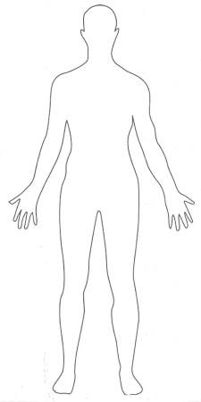
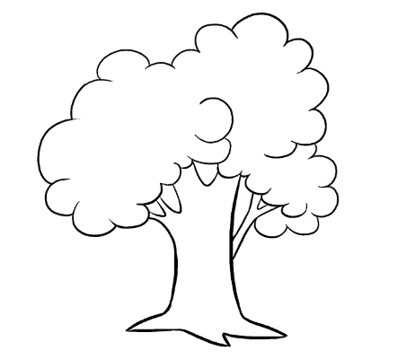
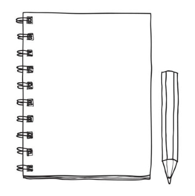

# Objektinis programavimas

## Vaizdo pamoka

Informacija ruošiama.

## Objektiniame programavime naudojamos sąvokos

- Klasė. Struktūra.
- Objektas.
- ...

## Apie klasę / struktūrą

- Klasę / struktūrą galite įsivaizduoti kaip šabloną ar brėžinį tam tikriems duomenims aprašyti.
- Kuriant klasę / struktūrą, jūs kuriate šabloną naujam duomenų tipui. Tokiu būdu apibūdinate iš ko bus sudarytas jūsų naujai sukurtas duomenų tipas. C++ kalboje jau yra kitų duomenų tipų, tokių kaip `int`, `double`, `string` ir pan., tai šiuo atveju tarsi kuriate savo.
- Klasėje / struktūroje realių duomenų neturėtų būti, nes klasė / struktūra yra tik šablonas pagal kurį bus galima surašyti duomenis. Tai, taip pat, galima įsivaizduoti kaip kai `excel` lapo viršuje aprašote stulpelių pavadinimus, su kuriais apibūdinate kokia informacija kuriame stulpelyje bus saugoma.
- Klasė / struktūra apibūdins kokie duomenys (su kintamųjų pagalba) galės būti priskiriami objektams, bei kokius veiksmus bus galima atlikti su objektais (su funkcijų / metodų pagalba).
- Klasę / struktūrą galima įsivaizduoti kaip kažką kas gali apibūdinti visų to paties tipo objektų bendrus atributus, t.y. kažką ką galima pasakyti apie kiekvieną tam tikro tipo objektą. Pavyzdžiui: visų automobilių bendri atributai (apie kiekvieną automobilį galima įvardinti šiuos dalykus) - markė, modelis, metai, rida, spalva...

## Klasių / struktūrų pavyzdžiai

### Klasės / struktūros pavyzdys - automobilis

Kokie bendri atributai sieja kiekvieną automobilį?

- Markė.
- Modelis.
- Pagaminimo metai.
- Rida.
- Darbinis tūris.
- ...

Kokius veiksmus gali kiekvienas automobilis arba ką galima nuveikti su kiekvienu automobiliu:

- Užsikurti.
- Važiuoti.
- Paskaičiuoti kiek kilometrų vidutiniškai nuvažiuoja per metus.
- ...

### Klasės / struktūros pavyzdys - žmogus

Kokie bendri atributai sieja kiekvieną žmogų?

- Vardas.
- Pavardė.
- Amžius.
- Ūgis.
- Lytis.
- Profesija.
- ...

Kokius veiksmus gali atlikti kiekvienas žmogus?

- Eiti į darbą.
- Valgyti.
- Vaikščioti.
- Paskaičiuoti kada gimęs.
- ...

### Klasės / struktūros pavyzdys - medis

Bendri kiekvieno medžio atributai:

- Pavadinimas.
- Aukštis.
- Amžius.
- Rūšis.
- ...

Medžių galimi atlikti veiksmai:

- Numesti lapus.
- ...

### Klasės / struktūros pavyzdys - prekė

Kiekvienos prekės bendri atributai:

- Pavadinimas.
- Kaina.
- Savikaina.
- Brūkšninis kodas.
- Kiekis.
- ...

Ką galima nuveikti su kiekviena preke?

- Išvesti jos informaciją.
- Paskaičuoti galimą pelną (kaina - savikaina).
- Nupirkti kažkiek vienetų (sumažinti kiekį per nurodytą dalį).
- ...

### Klasės / struktūros pavyzdys - ?

Jūsų eilė: kiekvienas sugalvokite dar bent po vieną klasės pavyzdį, apibūdinant  kokie atributai sieja kiekvieną iš tų objektų, bei kokius veiksmus jie gali atlikti.

## Kas yra objektas?

- Objektas - tai kažkas kas jau turi realius duomenis, kuriuos numatė klasė.
- Objektas tai tarsi kintamasis, kuriame yra sudėti kiti kintamieji, galintys plačiau apibūdinti tam tikrą dalyką.
- Objektai gali atlikti kokius nors veiksmus.
- Viena klasė gali turėti daug objektų.
- Objektai remiasi tos pačios klasės šablonu, tačiau kiekvienas objektas yra unikalus.
- Viskas ką turi objektas prieinama per tašką, t. y. rašant objekto pavadinimą, tuomet tašką ir galiausiai norimą pasiekti objekte dalyką (kintamąjį ar metodą).

## Klasių / struktūrų ir jų objektų pavyzdžiai

### Automobilio klasė / struktūra ir objektai

| Klasės / struktūros atributas (kintamasis) | Objektas nr. 1 | Objektas nr. 2 | Objektas nr. 3 |
|-|-|-|-|
| Markė | Audi | Tesla | Opel |
| Modelis | A4 | S | Astra |
| Rida | 300458 | 12487 | 314878 |
| Metai | 2015 | 2019 | 2009 |
| Darbinis tūris | 1.6 | 1.2 | 1.8 |

### Žmonių klasė / struktūra ir objektai

| Klasės / struktūros atributas (kintamasis) | Objektas nr. 1 | Objektas nr. 2 | Objektas nr. 3 |
|-|-|-|-|
| Vardas | Gintaras | Inga | Povilas |
| Amžius | 23 | 25 | 24 |
| Ūgis | 1.8 | 1.7 | 1.9 |
| Svoris | 85 | 55 | 89 |
| Profesija | Policininkas | Dizainerė | Programuotojas |
